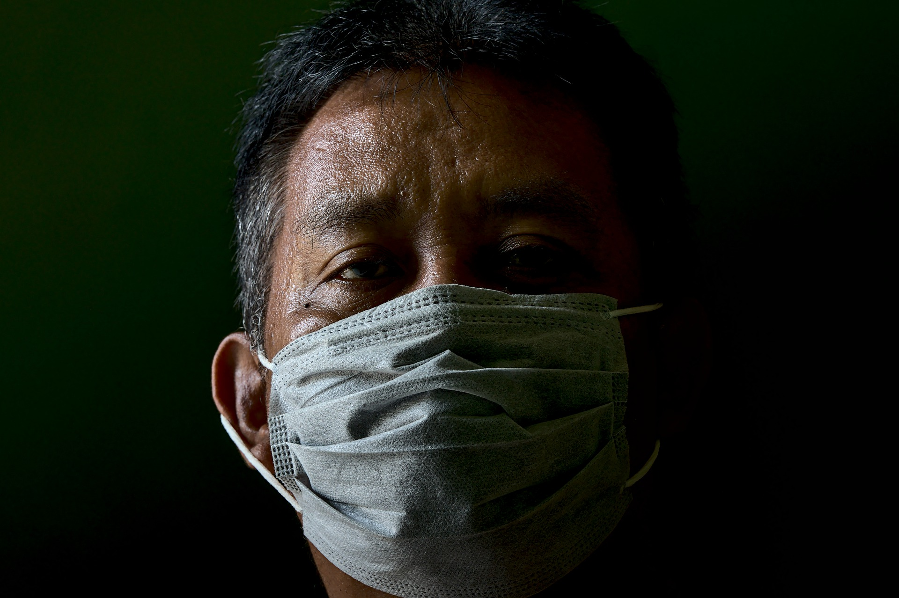

> Styles: [English](README.md), [Odia](Odia.md), [Translated](Translated.md).<br>
> [Click here to listen](https://soundcloud.com/teachersnigdha/let-the-plague-go).

```
In your court how can we live,
Tell us O Jagannath?
The light of life is fading,
You know our Creator.

Koel sang when the spring came,
Hot loos blew afterwards.
Then there was thunder and rain,
Still remains the catastrophe.

Neither the crowds nor the buzz,
Ghostly silence is ruling.
Not a word from anyone's mouth,
An acute danger is spreading.

Night not left for one dream,
Seven wishes are far away.
Soil, rocks, and sand lie untouched,
Outdoors stay empty.

Clouds in the sky of the mind,
When will it clear out.
Four-walled house's prisoner life,
Has become a big mess.

How long will the Lord hear the cry,
O Lord Krishna?
Your world is in turmoil,
Please come down here,
O Lord Krishna.

Your car festival is not far now,
How will it be completed?
Hurricane Corona, dear Lord,
Fly it away from the earth.

Do you not see hungry stomachs,
Do your not hear them cry?
Do you not hear prayers of sorrow,
Life is burning out.

Pour out the rays of hope,
And let the plague go.
Strong winds are blowing your world,
Please come down here,
Let the plague go.

How many days will the Lord hear the cry,
O Lord Krishna???
```

- Poem by Snigdharani Sahoo
- Image by pisauikan from Pixabay
