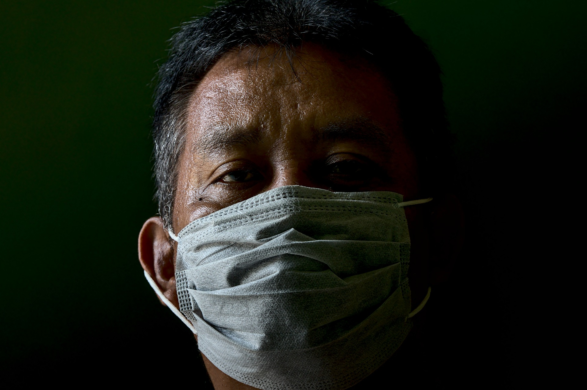

> Styles: [English](README.md), [Odia](Odia.md), [Translated](Translated.md).<br>
> [Click here to listen](https://soundcloud.com/teachersnigdha/let-the-plague-go).

```
Tell me how I will live in your court,
O Jagannath.
Livi Livi My face is burning,
You are Jan Bishwanath.

Malay sang Koili,
Jhanji also came out.
Occasionally there is a catastrophe,
And the catastrophe strikes.

Why doesn't the crowd show up,
Nirola does.
The language does not speak, why is the car in my mouth,
The greatness comes.

One night is not a dream,
Seven dreams are far away.
The ground was covered with sand,
And no one was there.

Clouds in the sky of the mind,
When it rains.
The life of a prisoner in a four-walled house,
Has become a big mess.

How long will the Lord hear the cry,
O Golak Bihari.
Your world is in turmoil,
Come on, come on,
Oh Golak Bihari.

How many more days will your Ghosh journey take,
How will it be completed?
Hurricane Corona, you world,
Fly away from the earth.

The hungry stomachs did not show up,
Did not hear or did they cry?
Shuheni ne Srihari, the beggar of sorrow,
Is dying.

Pour out the rays of hope,
And let the plague move.
Hurricane is falling in your world,
Let's land,
Move the plague.

How many days will the Lord hear the cry,
Oh Golak Bihari???
```

- Poem by Snigdharani Sahoo
- Image by pisauikan from Pixabay
